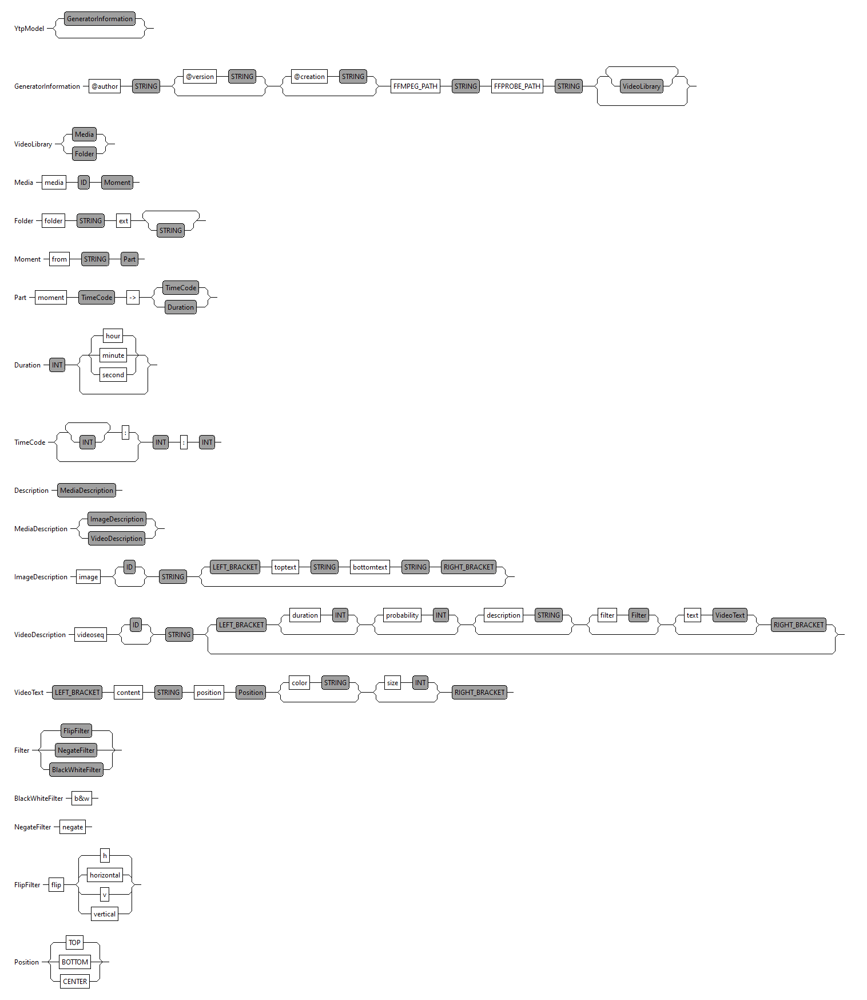

YTP DSL
===

A Domain Specific Language to generate videos based on video libraries and some math.

It is inspired by https://github.com/FAMILIAR-project/VideoGen2 and https://twitter.com/acherm video editing DSL.

This project has two main goals:

* provide a cool playground for DSL and model oriented software and how to tackle technical stuff,
* produce dumb content and crappy videos.

Main difference is that this project doesn't aim to produce regular video editing but to provide a fun way to generate random sequences at every run.

The language is there to construct a set of inputs to guide the stochastic decisions: total duration of the output clip, number of cuts, type of transition etc.

Backend video editing is based on [ffmpeg](https://ffmpeg.org) and a [java wrapper](https://github.com/bramp/ffmpeg-cli-wrapper). 
For now all the magic happens in `fr.ytpdsl.parent/fr.ytpdsl/`

# Features

A cool DSL, lame videos and bad algorithm for bad editing.

Grammar based DSL with no concrete internal structure yet, using a Java ffmpeg wrapper as a backend.

# Grammar

The grammar is moving with the development of new features, some part are from the original project or here as draft of upcoming or test features.

# Roadmap

- [ ] standalone version, i.e java and maven only, no Eclipse RCP to build and use,
- [ ] store metadata of linked media to a local db,
- [ ] separate library media from media definiton from a path and a time code+duration,
- [ ] allow custom filter to be written,
- [ ] generic input connector for yt link or remote content,
- [ ] text to speech to add audio track on existing audio&video or in place of audio
- [ ] media analysis such as audio bpm, srt NLP

and so much more, from better input (besides DSL) to better output (direct uploading to host server).

# Contributing

This is a toy project, nothing big but if you have feedbacks open an issue or ping on [twitter](https://twitter.com/Rio_Alx) or even by email (details on my website).